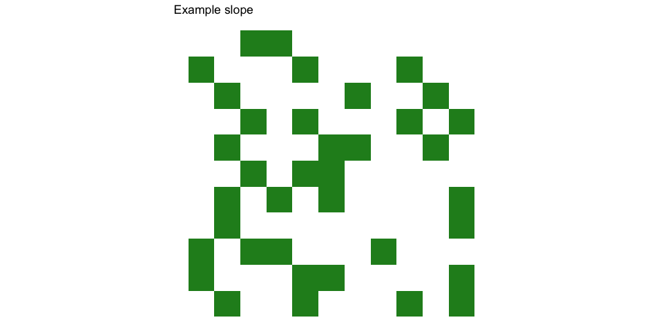
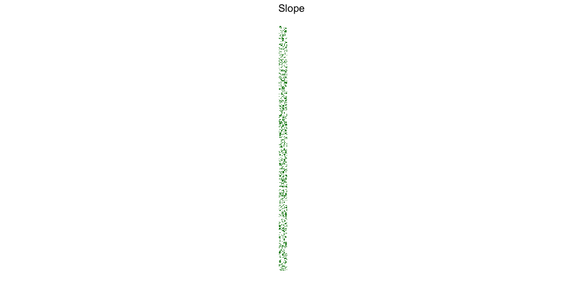

Day 3: Toboggan Trajectory
================
Jonas Nockert (@lemonad)

I’m using R for this year’s Advent of Code. Learning as I go, which is
quite obvious here : )

Testing with the example data seems like a good first step. Not sure
what representation is most useful in R, perhaps matrix format?

``` r
example_input <- trimws(
"
..##.......
#...#...#..
.#....#..#.
..#.#...#.#
.#...##..#.
..#.##.....
.#.#.#....#
.#........#
#.##...#...
#...##....#
.#..#...#.#
"
)

example_slope <- str_replace_all(example_input, "\\n", "") %>%
  str_split("") %>%
  unlist() %>%
  matrix(nrow = 11, ncol = 11, byrow = TRUE)
```

Let’s plot the resulting slope matrix to see that it looks correct
(which turned out easier said than done):

``` r
plot_slope <- function(slope, title) {
  slope %>%
    as_tibble() %>%
    mutate(y = row_number()) %>%
    pivot_longer(cols = 1:11, names_to = "x") %>%
    transmute(
      y = y,
      x = as.integer(str_sub(x, 2)),
      value = as.integer(ifelse(value == "#", 1, 0))
    ) %>%
    ggplot(aes(x = x, y = -y, fill = value)) +
    geom_tile() +
    scale_fill_gradient(low = "white", high = "forestgreen") +
    coord_equal() +
    xlab("") +
    ylab("") +
    labs(title = title) +
    theme_void() +
    theme(legend.position = "none")
}

plot_slope(example_slope, "Example slope")
```

    ## Warning: The `x` argument of `as_tibble.matrix()` must have unique column names if `.name_repair` is omitted as of tibble 2.0.0.
    ## Using compatibility `.name_repair`.
    ## This warning is displayed once every 8 hours.
    ## Call `lifecycle::last_warnings()` to see where this warning was generated.

<!-- -->

Using the example input, the expectation is that we encounter 7 trees.

``` r
ride_slope <- function(slope, step) {
  n_rows <- dim(slope)[1]
  n_cols <- dim(slope)[2]
  pos <- c(1, 1)

  n_trees <- 0
  while (pos[1] <= n_rows) {
    if (slope[pos[1], pos[2]] == "#") {
      n_trees <- n_trees + 1
    }
    pos <- c(pos[1] + step[1], 1 + (pos[2] + step[2] - 1) %% n_cols)
  }
  return(n_trees)
}

n_trees <- ride_slope(example_slope, c(1, 3))
print(
  paste("We encountered", n_trees, "trees.")
)
```

    ## [1] "We encountered 7 trees."

Sounds about right so let’s try it on the real input:

``` r
lines <- read_lines("./input/december03.input")
rows <- length(lines)
slope <- str_replace_all(lines, "\\n", "") %>%
  str_split("") %>%
  unlist() %>%
  matrix(nrow = rows, byrow = TRUE)

plot_slope(slope, "Slope")
```

<!-- -->

``` r
n_trees <- ride_slope(slope, c(1, 3))
print(
  paste("We encountered", n_trees, "trees.")
)
```

    ## [1] "We encountered 176 trees."

## Part 2

For the second part, we will try a few different traverses. Here we
expect the product of encountered trees to be 336.

``` r
prod_trees <- function(slope) {
  return(
    prod(
      ride_slope(slope, c(1, 1)),
      ride_slope(slope, c(1, 3)),
      ride_slope(slope, c(1, 5)),
      ride_slope(slope, c(1, 7)),
      ride_slope(slope, c(2, 1))
    )
  )
}

print(
  paste("Product of trees encountered:", prod_trees(example_slope))
)
```

    ## [1] "Product of trees encountered: 336"

Finally, on the slope we’ve been given:

``` r
print(
  paste("Product of trees encountered:", prod_trees(slope))
)
```

    ## [1] "Product of trees encountered: 5872458240"
