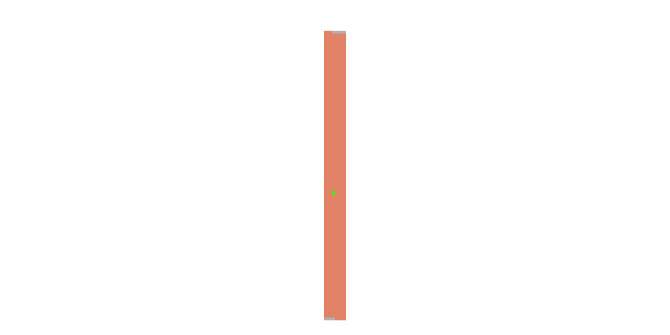

Day 5: Binary Boarding
================
Jonas Nockert (@lemonad)

I’m using R for this year’s Advent of Code. Learning as I go, which is
quite obvious here : )

We’ll start with reading the input and seeing that it conforms to what I
think are the rules. First 7 are row partition characters (127 seat
rows), followed by 3 seating partition characters (8 seats per row):

``` r
lines <- read_lines("input/december05.input")
lines %>% str_detect("^[BF]{7}[LR]{3}$") %>% all()
```

    ## [1] TRUE

Great! Now, we can write a function to take a boarding pass and
transform into a seat id. The idea is that the `BF` part is a 7-bit
binary representation, giving row values 0–126. The `FR` part is a 3-bit
binary representation giving seat values 0-7. The final seat ID is given
by `row * 8 * seat`.

But wait. That means that it’s just a 10-bit representation:

``` r
get_seat_id <- function(.data) {
  # Enable piping a vector/list into the function? Weird that
  # typeof(c("aa", "bb")) == typeof("aa") == "character" so
  # using `is.vector`, `is.list` or similar does not work.
  if (length(.data) > 1) {
    return(map_int(.data, get_seat_id))
  }

  m <- .data %>%
    str_extract("^[BFLR]{10}$")
  if (is.na(m)) return(NA)

  z <- Map(c, unlist(str_split(m, "")), 9:0)
  reduce(
    z,
    function(acc, x) {
      ifelse(
        x[1] == "F" || x[1] == "L",
        acc,
        acc + bitwShiftL(1, x[2])
      )
    },
    .init = 0L
  )
}
```

Let’s test it out on the given examples:

``` r
all(
  get_seat_id("FBFBBFFRLR") == 357,
  get_seat_id("BFFFBBFRRR") == 567,
  get_seat_id("FFFBBBFRRR") == 119,
  get_seat_id("BBFFBBFRLL") == 820
)
```

    ## [1] TRUE

OK! Now, we want to get the highest seat ID of all boarding passes:

``` r
seat_ids <- lines %>%
  get_seat_id()

seat_ids %>%
  max()
```

    ## [1] 883

## Part two

Here we are trying to find our seat on a full flight. These are the
seats missing from our list of seat ids:

``` r
missing <- 0:1023 %>% setdiff(seat_ids)
missing
```

    ##   [1]    0    1    2    3    4    5    6    7    8    9   10   11   12   13   14
    ##  [16]   15   16   17   18   19   20   21   22   23   24   25   26   27   28   29
    ##  [31]   30   31   32   33   34   35   36   37   38   39   40   41   42   43   44
    ##  [46]   45   46   47   48   49   50   51   52   53   54   55   56   57   58   59
    ##  [61]   60   61   62   63   64   65   66   67   68   69   70   71   72   73   74
    ##  [76]   75   76   77   78   79   80   81   82   83   84  532  884  885  886  887
    ##  [91]  888  889  890  891  892  893  894  895  896  897  898  899  900  901  902
    ## [106]  903  904  905  906  907  908  909  910  911  912  913  914  915  916  917
    ## [121]  918  919  920  921  922  923  924  925  926  927  928  929  930  931  932
    ## [136]  933  934  935  936  937  938  939  940  941  942  943  944  945  946  947
    ## [151]  948  949  950  951  952  953  954  955  956  957  958  959  960  961  962
    ## [166]  963  964  965  966  967  968  969  970  971  972  973  974  975  976  977
    ## [181]  978  979  980  981  982  983  984  985  986  987  988  989  990  991  992
    ## [196]  993  994  995  996  997  998  999 1000 1001 1002 1003 1004 1005 1006 1007
    ## [211] 1008 1009 1010 1011 1012 1013 1014 1015 1016 1017 1018 1019 1020 1021 1022
    ## [226] 1023

This does not look like a full flight but apparently, some seats are
missing at the very front and back of the plane so it’s quite obvious
which seat is ours. However, since we know we will have a series of
consecutive numbers followed by a gap (it is given that seats +1 and -1
from ours are taken) and then our seat, a gap, and then consecutive
numbers again, we can find our seat using the following:

``` r
# The second index represents the number before the second gap (our seat id!)
our_seat <- missing[diff(missing) > 1][2]
our_seat
```

    ## [1] 532

Where is this seat located in the plane? First, we need to figure out
how many rows are missing from the plane:

``` r
our_index <- match(our_seat, missing)
max(missing[0:(our_index - 1)]) / 8
```

    ## [1] 10.5

``` r
min(missing[(our_index + 1):length(missing)]) / 8
```

    ## [1] 110.5

Ah, so it’s actually a number of whole rows *and* some seats missing.
OK, let’s try this setup:

``` r
missing_front <- floor(max(missing[0:(our_index - 1)]) / 8) * 8 - 1
missing_back <- ceiling(min(missing[(our_index + 1):length(missing)]) / 8) * 8
rows_missing <- c(0:missing_front, missing_back:1023)
seats_missing <- missing %>% setdiff(rows_missing) %>% setdiff(our_seat)
```

We can now visualize the seating on the plane, where the front of the
plane is up (I think : )

``` r
0:1023 %>%
  setdiff(rows_missing) %>%
  matrix(nrow = 8) %>%
  t() %>%
  as_tibble() %>%
  mutate(
    across(
      .cols = everything(),
      function(x) {
        case_when(
          x %in% seats_missing ~ 2,
          x == 532 ~ 1,
          TRUE ~ 0
        )
      }
    )
  ) %>%
  mutate(y = row_number()) %>%
  pivot_longer(cols = 1:8, names_to = "x") %>%
  mutate(
    x = as.integer(str_sub(x, 2)),
    value = as.factor(value)
  ) %>%
  ggplot(aes(x = -x, y = -y, fill = value)) +
  geom_tile() +
  scale_fill_manual(values = c("darksalmon", "green", "gray")) +
  coord_equal() +
  xlab("") +
  ylab("") +
  labs(title = "") +
  theme_void() +
  theme(legend.position = "none")
```

    ## Warning: The `x` argument of `as_tibble.matrix()` must have unique column names if `.name_repair` is omitted as of tibble 2.0.0.
    ## Using compatibility `.name_repair`.
    ## This warning is displayed once every 8 hours.
    ## Call `lifecycle::last_warnings()` to see where this warning was generated.

<!-- -->
